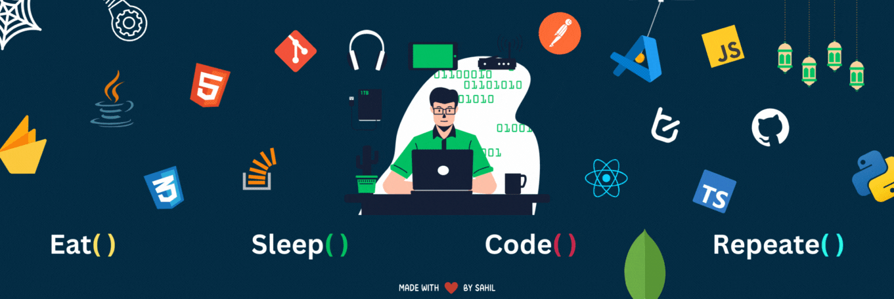

<h1 align="center">
   
</h1>

<h5>
   
🌱 I’m currently learning **DSA** and the **MERN stack**

📫 Officials can reach me at **[sahiljaiswal757@gmail.com](mailto:sahiljaiswal757@gmail.com)**

🤝 I’m open to project **Collaborations**!

⚡ I also love **Music** and **Photography**
</h5>

 
  
  

  

---

 <h1 align="center" >🛠️ Tools-Languages-Frameworks 🛠️ </h1>

   

      
      
      
      
   

   

      
      
      
      
      
      
      
      
   

---

  <h1 align="center"> ⚡Stats⚡ </h1>

  

  

